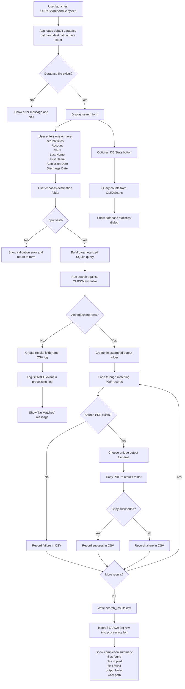

# OLRX Search And Copy Workflow

```mermaid
flowchart TD
    A["User launches OLRXSearchAndCopy.exe"] --> B["App loads default database path and destination base folder"]
    B --> C{"Database file exists?"}

    C -- "No" --> C1["Show error message and exit"]
    C -- "Yes" --> D["Display search form"]

    D --> E["User enters one or more search fields:
    Account
    MRN
    Last Name
    First Name
    Admission Date
    Discharge Date"]

    E --> F["User chooses destination folder"]
    F --> G{"Input valid?"}

    G -- "No" --> G1["Show validation error and return to form"]
    G -- "Yes" --> H["Build parameterized SQLite query"]

    H --> I["Run search against OLRXScans table"]
    I --> J{"Any matching rows?"}

    J -- "No" --> J1["Create results folder and CSV log"]
    J1 --> J2["Log SEARCH event in processing_log"]
    J2 --> J3["Show 'No Matches' message"]

    J -- "Yes" --> K["Create timestamped output folder"]
    K --> L["Loop through matching PDF records"]

    L --> M{"Source PDF exists?"}
    M -- "No" --> M1["Record failure in CSV"]
    M -- "Yes" --> N["Choose unique output filename"]
    N --> O["Copy PDF to results folder"]
    O --> P{"Copy succeeded?"}

    P -- "Yes" --> P1["Record success in CSV"]
    P -- "No" --> P2["Record failure in CSV"]

    M1 --> Q{"More results?"}
    P1 --> Q
    P2 --> Q

    Q -- "Yes" --> L
    Q -- "No" --> R["Write search_results.csv"]

    R --> S["Insert SEARCH log row into processing_log"]
    S --> T["Show completion summary:
    files found
    files copied
    files failed
    output folder
    CSV path"]

    D --> U["Optional: DB Stats button"]
    U --> V["Query counts from OLRXScans"]
    V --> W["Show database statistics dialog"]
```
